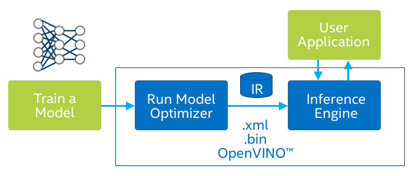
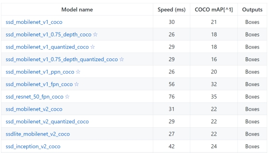
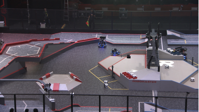
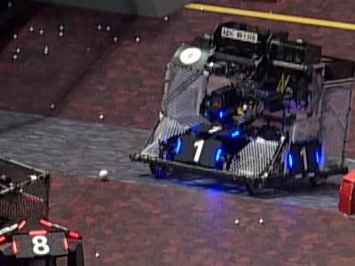

# [CPU+目标检测] openvino遇上robomaster自瞄（开源模型）

## 0．introduction
在robomaster比赛中，选手往往使用颜色分离，提取轮廓，匹配轮廓的方式来识别装甲板，但往往会花费大量时间在现场调整参数，于是我们想：能否利用深度学习来做自瞄以提高其鲁棒性？但深度学习算法在实时性上通常表现不好，在1080ti这样的显卡才能达到实时，但没人会在机器人上带一个煤气灶吧。很多人会想到使用Tensor RT，或者模型剪枝/压缩，低比特推理的方式提高深度学习算法在GPU上的速度，但很多人没有想到使用纯CPU也能实时运行神经网络。凭借Intel团队发布的openvino，我们可以在Intel CPU或者计算棒上实时运行目标检测算法，大大提高了robomaster自瞄的上界。在这里我们以CPU+计算棒的方式介绍完整的实现步骤。
How it works？
分为三个步骤
1. 训练自己的模型或者使用官方的demo
2. 将模型转换至中间表示层
3. 部署

根据官网上的信息，openvino对TensorFlow支持的最好，所以我们这里以谷歌的模型库为示例，走通上述的pipeline。

<center>检测demo</center>

## 1．使用TensorFlow Object Detection API 训练自己的模型（以robomaster数据集为例）

### 1.1 使用的模型库

[链接](<https://github.com/tensorflow/models/tree/master/research/object_detection>)

TensorFlow Object Detection API是谷歌爸爸开源的模型库，包含了完整的训练和评测代码。

模型包括主流的检测和分割网络，有SSD，Faster rcnn，mask rcnn，主干网包括mobilenet v1/v2/v3(看出谷歌爸爸的偏心了吧)，inception v2，resnet 50/101。

 
<center>SSD家族，map代表检测准确度，越大越好</center>


### 1.2 数据集

大疆在2020年初开源了一个俯视视角的数据集，具体特征类似于大家看直播时的画面。分辨率是1920*1080。官方的用意应该是给雷达站做目标检测，放在自瞄这样的平视场景会存在一定的gap，同时分辨率也过大，增大计算负担。所以我们在官方数据集的基础上进行了魔改，改动如下：

1. 对原图进行crop操作。针对一张图的每一个物体，先给该物体中心点一个30个像素点以内的上下左右漂移，然后以此点为中心，扣取400*300的图像。
2. 将原有的VOC数据集格式改为COCO格式，为了方便评测
3. 类别仅有红色装甲板和蓝色装甲板，至于为什么没有数字会在下面解答

 
<center>装甲板非常小</center>

 
<center>装甲板可见</center>

下载链接：[百度云](https://pan.baidu.com/s/105vjTcDs6XZHtnXAgCx86g )
提取码：v8yg

### 1.3 训练+评测

Prerequisite：显卡：最好1080ti往上。单卡v100三个小时训练完毕。

pip install tensorflow-gpu==1.14 最好使用1.14版本的TF

Linux系统

#### 1.3.1 安装TensorFlow Object Detection API

请参考 [官方安装指令](<https://github.com/tensorflow/models/blob/master/research/object_detection/g3doc/installation.md>)

#### 1.3.2 修改配置文件

0. 将coco数据集转换为tfrecord格式
```
python object_detection/dataset_tools/create_coco_tf_record.py --logtostderr \
  --train_image_dir="data/roco_train" \
  --val_image_dir="data/roco_val" \
  --test_image_dir="data/roco_val" \
  --train_annotations_file="data/train.json" \
  --val_annotations_file="data/val.json" \
  --testdev_annotations_file="data/val.json" \
  --output_dir="models/research/save_dir"
```
   目录根据自己的实际位置更改，其中test可以忽略

1. 模型config

所有模型配置文件在models/research/object_detection/samples/configs目录下，以ssd_mobilenet_v2_coco.config为例。

需要修改的地方①num_classes: 2 ②image_resizer：height: 300 width: 400 ③fine_tune_checkpoint ④最后的数据位置
数据扩充：水平翻转，亮度，对比度，饱和度随机抖动
```
  data_augmentation_options {
    random_horizontal_flip {
    }
  }
  data_augmentation_options {
    random_adjust_brightness {
      max_delta: 0.2
    }
  }
  data_augmentation_options {
    random_adjust_contrast {
      min_delta: 0.7
      max_delta: 1.1
    }
  }
  data_augmentation_options {
    random_adjust_saturation {
      min_delta: 0.9
      max_delta: 1.1
    }
  }
```

2. 数据config

在models/research/object_detection/data/*.pbtxt里记录了数据集的类别，这里我们是两类，所以将label_map_path中的文件替换为以下字段：（注意文件名对应）
```
item {
  name: "/m/01g317"
  id: 1
  display_name: "armor_blue"
}
item {
  name: "/m/0199g"
  id: 2
  display_name: "armor_red"
}
```
训练代码
```
export PYTHONPATH=$PYTHONPATH:`pwd`:`pwd`/slim
CUDA_VISIBLE_DEVICES=0 python object_detection/model_main.py \
--pipeline_config_path=object_detection/samples/configs/ssd_mobilenet_v2_coco.config \
    --model_dir='output_model' \
    --num_train_steps=500000 \
    --sample_1_of_n_eval_examples=10 \
    --alsologtostderr
```

v100训练2个小时就收敛了，1080ti可能三小时。训练过程中会边训练边评测。

这里我们关注的是mAP(0.5:0.95)和AP(0.5)，可以看到mAP是0.537，AP是0.974，基本满足需求。

```
 Average Precision  (AP) @[ IoU=0.50:0.95 | area=   all | maxDets=100 ] = 0.537
 Average Precision  (AP) @[ IoU=0.50      | area=   all | maxDets=100 ] = 0.974
 Average Precision  (AP) @[ IoU=0.75      | area=   all | maxDets=100 ] = 0.531
 Average Precision  (AP) @[ IoU=0.50:0.95 | area= small | maxDets=100 ] = 0.529
 Average Precision  (AP) @[ IoU=0.50:0.95 | area=medium | maxDets=100 ] = 0.613
 Average Precision  (AP) @[ IoU=0.50:0.95 | area= large | maxDets=100 ] = -1.000 Average Recall     (AR) @[ IoU=0.50:0.95 | area=   all | maxDets=  1 ] = 0.220
 Average Recall     (AR) @[ IoU=0.50:0.95 | area=   all | maxDets= 10 ] = 0.618
 Average Recall     (AR) @[ IoU=0.50:0.95 | area=   all | maxDets=100 ] = 0.619
 Average Recall     (AR) @[ IoU=0.50:0.95 | area= small | maxDets=100 ] = 0.607
 Average Recall     (AR) @[ IoU=0.50:0.95 | area=medium | maxDets=100 ] = 0.684
 Average Recall     (AR) @[ IoU=0.50:0.95 | area= large | maxDets=100 ] = -1.000
```

当然，我们也放出来了模型文件

下载链接：[百度云](https://pan.baidu.com/s/1-m1ovofM_X9rh4rlQEicFg )
提取码：4nra 

## 2．Openvino模型转换

### 2.1 安装openvino

在Linux下的安装请参阅 [官方文档](<https://docs.openvinotoolkit.org/latest/_docs_install_guides_installing_openvino_linux.html>)（很简单）

同时还可以查看 [b站视频](<https://www.bilibili.com/video/BV1fC4y1s7dt>)

### 2.2 模型转换

仍然在TensorFlow models文件夹下，先提取inference_graph
```
python object_detection/export_inference_graph.py \
--input_type=image_tensor \ 
--pipeline_config_path=object_detection/samples/configs/ssdlite_mobilenet_v2_coco.config \ --trained_checkpoint_prefix=models/research/output_model/model.ckpt-18723 \--output_directory=models/research/exported_model
```

将inference_graph转换为openvino接受的格式也就是intermediate representation。这里需要注意ssd mobilenetv2对应的是ssd_support_api_v1.15.json

```
python3 mo_tf.py --input_model=exported_model/frozen_inference_graph.pb --transformations_config /opt/intel/openvino/deployment_tools/model_optimizer/extensions/front/tf/ssd_support_api_v1.15.json --tensorflow_object_detection_api_pipeline_config exported_model/pipeline.config --reverse_input_channels 
```

Python测试模型
```
python3 object_detection_demo_ssd_async.py -m /home/lilelife/onnx/ssdv2/frozen_inference_graph.xml -i *.avi
```

C艹测试模型（记得先编译源码）
```
./object_detection_demo_ssd_async -i *.mp4 -m ssdv2/frozen_inference_graph.xml
```
